# AEGISX Architecture Diagrams

## 1. System Architecture

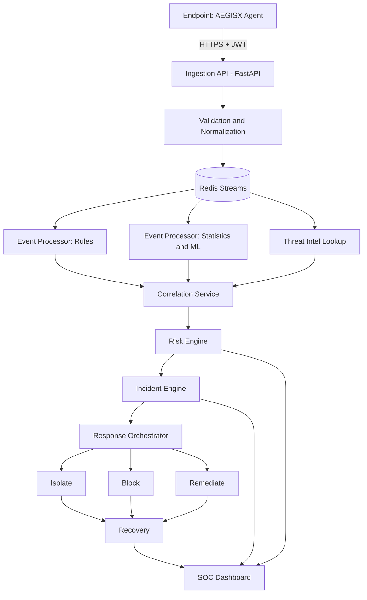

## 2. Security Layers

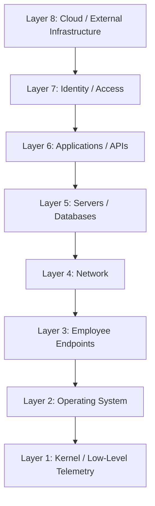

## 3. Agent Architecture

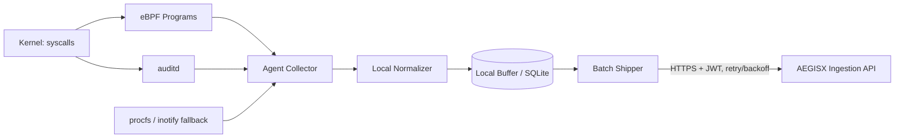

## 4. Telemetry Flow

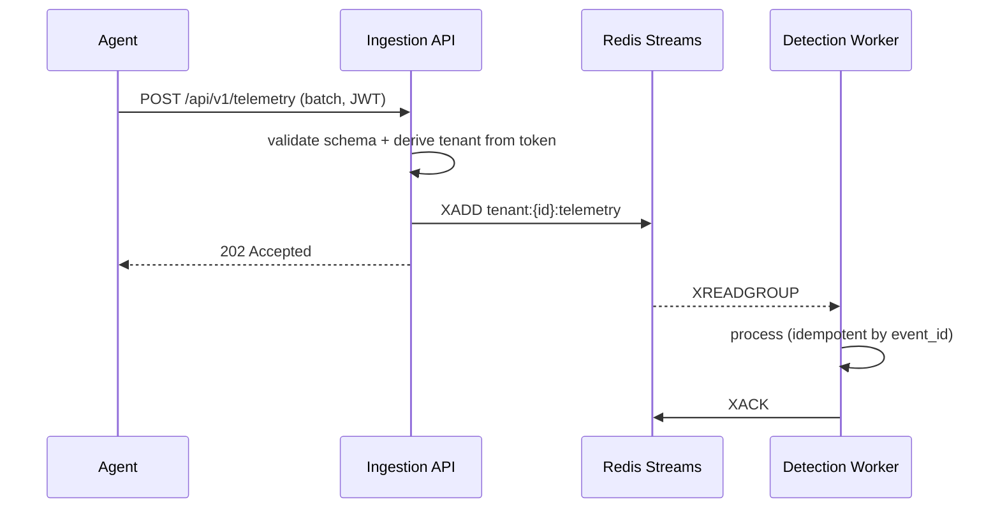

## 5. Detection Flow

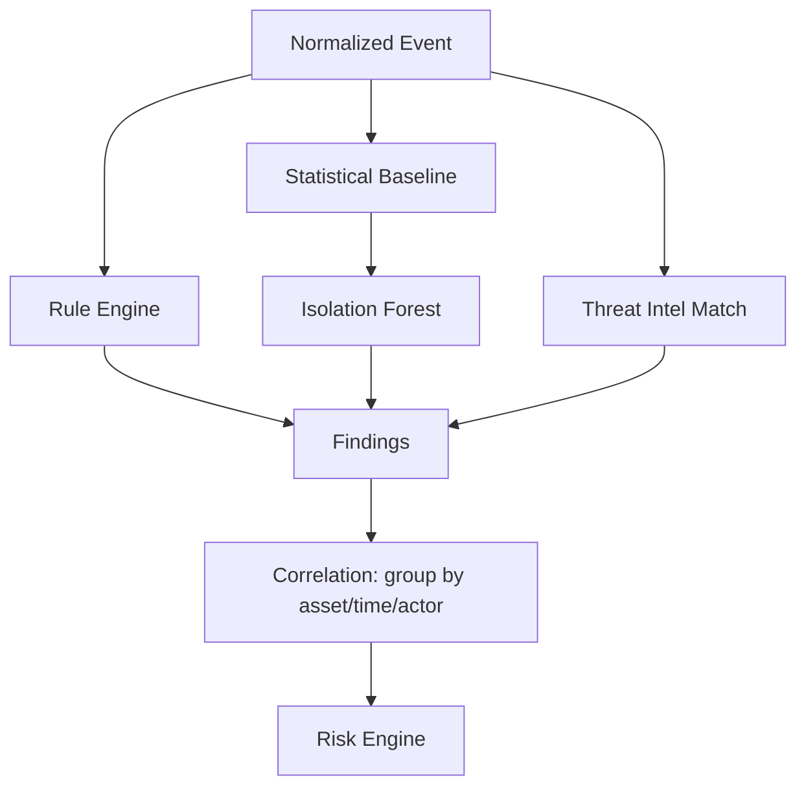

## 6. AI Flow

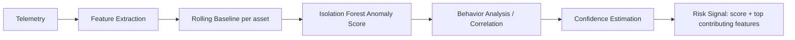

## 7. Incident Lifecycle

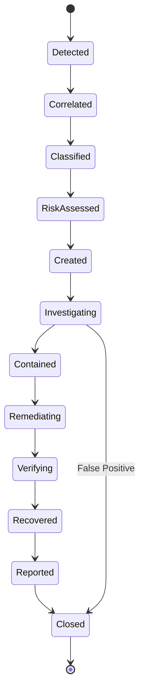

## 8. Response Lifecycle

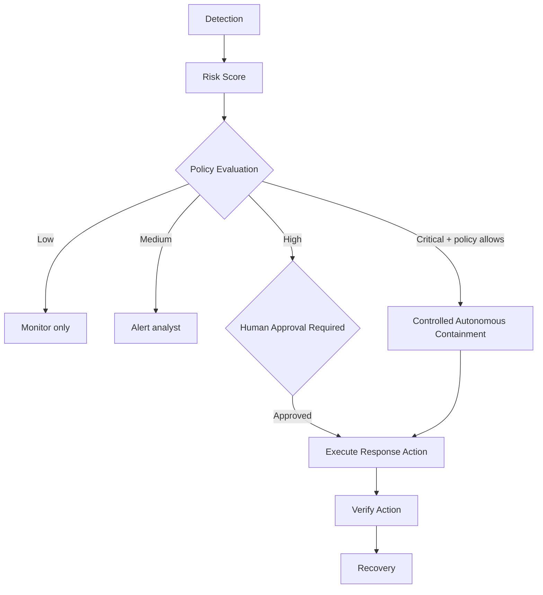

## 9. MSSP Multi-Tenancy

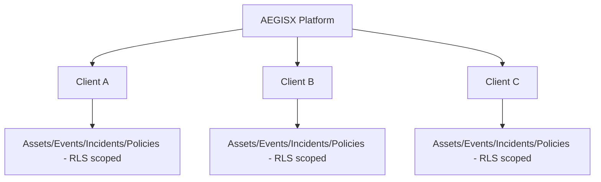

## 10. Database Relationships (Core Entities)

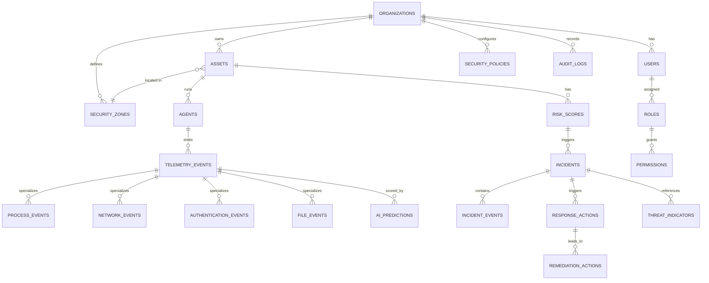

## 11. Deployment Architecture

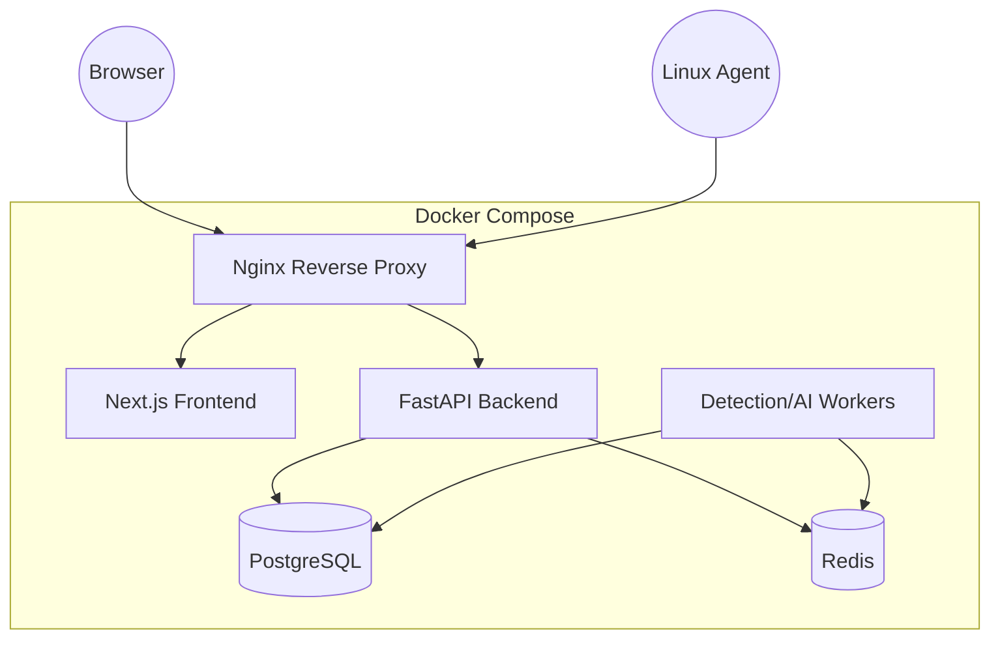

## 12. Trust Boundaries

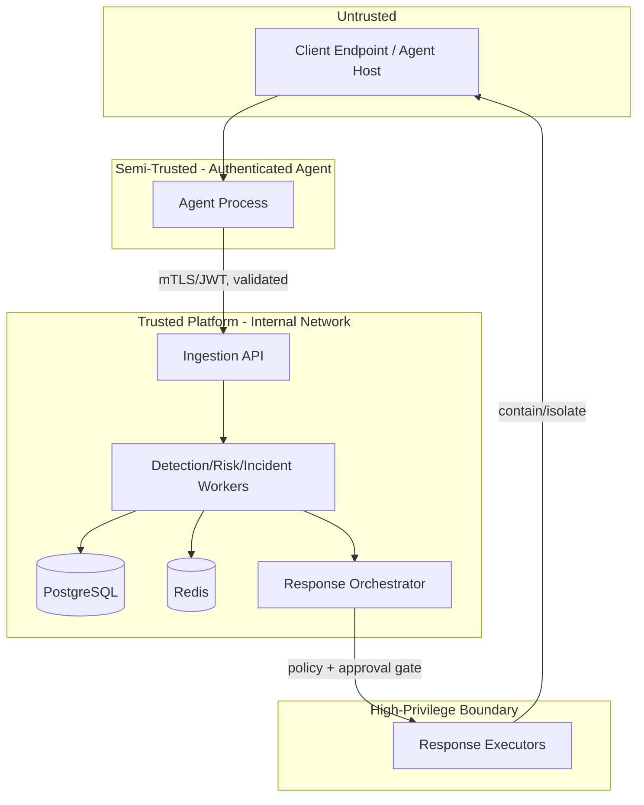
